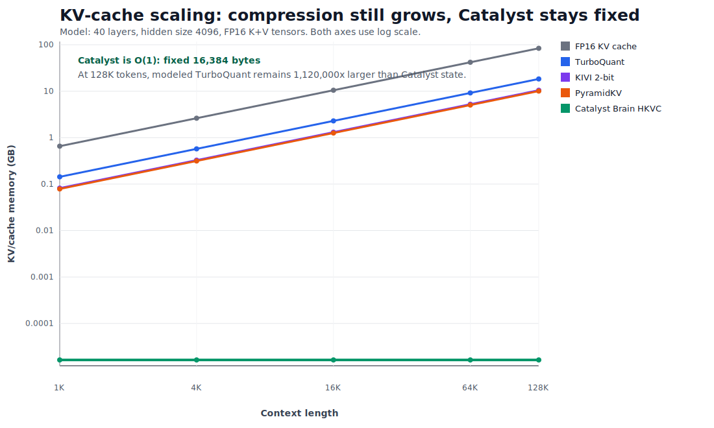

# Catalyst KV Cache

Research drop-in KV-cache adapter backed by the public `catalyst-brain` SDK
wheel.

Install the SDK from PyPI and start experimenting immediately. The Catalyst
Brain free tier is generous, does not require registration, and does not need an
API key for early local evaluation. Most research, benchmark, and prototype
workflows should not hit free-tier limits while you are getting started.

When this adapter moves toward production inference, hosted services,
enterprise deployment, customer pilots, or higher-volume API usage, contact:

```text
hello@strategic-innovations.ai
```

## What It Is

`catalyst-kv-cache` gives researchers a minimal drop-in adapter for testing
Catalyst's fixed-state holographic KV-cache approach without source access to
the closed SDK. It installs the public `catalyst-brain` wheel from PyPI and uses
only public SDK APIs. The public adapter shows integration behavior and results;
the core Catalyst engine remains inside the Catalyst Brain SDK.

## Scaling Results

The breakthrough is not another linear compression curve. TurboQuant, KIVI, and
PyramidKV are strong recent KV-cache compression systems, but they still scale
with context length. Catalyst Brain HKVC uses fixed holographic state through
the public `catalyst-brain` SDK surface, so the modeled state stays flat as
tokens grow.



Model assumptions for the chart:

- Baseline FP16 KV cache: `tokens * 40 layers * 4096 hidden * 2 K/V tensors * 2 bytes`
- TurboQuant: modeled from the published 3.5 bits/channel quality-neutral point
- KIVI: modeled as 2-bit KV versus FP16
- PyramidKV: modeled from the published 12% KV retention setting
- Catalyst Brain HKVC: measured from the public SDK as fixed 4096-dim Catalyst state

At 128K tokens under this model:

| Method | Modeled memory | Shape |
|---|---:|---|
| FP16 KV cache | 83.89 GB | Linear |
| TurboQuant | 18.35 GB | Linear compressed |
| KIVI 2-bit | 10.49 GB | Linear compressed |
| PyramidKV | 10.07 GB | Linear retained |
| Catalyst Brain HKVC | 0.016 MB | Fixed holographic state |

The generated source data is in [docs/kv_cache_scaling.csv](docs/kv_cache_scaling.csv);
source notes are in [docs/SOURCES.md](docs/SOURCES.md).
This repo intentionally shows only adapter code, integration behavior, and
public SDK results. It does not expose Catalyst Brain trade secrets.

## First Evidence Package

The first HKVC evidence package is checked in under
[evidence/hkvc-first-evidence-package](evidence/hkvc-first-evidence-package).
It contains the scoped breakthrough verdict, fixed-state memory and retrieval
artifacts, RULER/Needle-style synthetic evidence, private-context memory
models, and the first Catalyst Manifold Attention gap-closing experiment. Any
benchmark path that needs private Catalyst algorithms now delegates to the
installed `catalyst-brain` SDK; this public repo keeps the adapter, artifacts,
charts, and claim metadata.

Key artifacts:

- [site/breakthrough_assessment.json](evidence/hkvc-first-evidence-package/site/breakthrough_assessment.json)
- [site/fixed_state_quality_results.json](evidence/hkvc-first-evidence-package/site/fixed_state_quality_results.json)
- [site/ruler_needle_results.json](evidence/hkvc-first-evidence-package/site/ruler_needle_results.json)
- [site/manifold_attention_results.json](evidence/hkvc-first-evidence-package/site/manifold_attention_results.json)
- [site/lossless_equivalence_results.json](evidence/hkvc-first-evidence-package/site/lossless_equivalence_results.json)
- [site/lossless_scale_results.json](evidence/hkvc-first-evidence-package/site/lossless_scale_results.json)
- [site/tier2_evidence_results.json](evidence/hkvc-first-evidence-package/site/tier2_evidence_results.json)
- [site/next_evidence_results.json](evidence/hkvc-first-evidence-package/site/next_evidence_results.json)
- [site/official_longbench_ruler_results.json](evidence/hkvc-first-evidence-package/site/official_longbench_ruler_results.json)
- [site/rain_transport_probe_results.json](evidence/hkvc-first-evidence-package/site/rain_transport_probe_results.json)
- [site/index.html](evidence/hkvc-first-evidence-package/site/index.html)

Current scoped verdict: Catalyst HKVC is a breakthrough for fixed-state
private long-context memory and stateless handoff. Universal lossless
replacement is now tracked as an exact-state/tiled-attention SDK path: it can
match full KV attention when exact state is retained or hydrated. The current
lossless evidence tier covers decode overflow, causal prefill, additive
mask attention, and a small multi-layer decode stack; this is a different
claim from fixed-size compact semantic compression.

The first adapter is intentionally conservative:

- `passthrough` mode preserves model behavior by returning original key/value
  states from `update(...)` while recording fixed-size Catalyst state.
- `refs` mode returns compact references for serving stacks that explicitly opt
  into Catalyst-managed cache materialization.
- Hugging Face style methods such as `update`, `get_seq_length`,
  `get_usable_length`, `reorder_cache`, and `reset` are provided for research
  integration work.

## Install the SDK

```bash
python -m pip install catalyst-brain
```

This repo is the adapter/demo layer. The only PyPI package users need for the
SDK surface is `catalyst-brain`.

To run this adapter repo locally:

```bash
python3 -m venv .venv
. .venv/bin/activate
python -m pip install --upgrade pip
python -m pip install catalyst-brain
python -m pip install -e ".[dev]"
pytest -q
```

After install, run the onboarding checks:

```bash
catalyst-kv-cache doctor
catalyst-kv-cache onboard
catalyst-kv-cache smoke --mode passthrough
catalyst-kv-cache serve --dry-run --json
```

`doctor` reports which `catalyst-brain` SDK features are available locally.
If evidence-generation exports are missing, upgrade/install a Catalyst Brain
SDK build that includes the private HKVC evidence runners; this public repo
will not ship those algorithms directly.

## OpenAI-Compatible Serve Shim

The adapter also ships a small stdlib server shim for local onboarding and
serving-stack integration tests:

```bash
catalyst-kv-cache serve --host 127.0.0.1 --port 8088
```

Routes:

- `GET /healthz`
- `GET /v1/models`
- `POST /v1/chat/completions`

This shim validates the public HTTP shape and SDK readiness boundary. It does
not ship Catalyst Brain internals or a production scheduler; attach private
generation, batching, and HKVC materialization through the `catalyst-brain` SDK
or a hosted Catalyst backend.

## RAIN Worker Transport

The next evidence path is a Catalyst RAIN (`.rain`) Worker execution mode for official
benchmarks and private AI serving. The public adapter can send either a plain
prompt or a reversible packed-token envelope (`uint32le + gzip + base64`) with
tokenizer metadata and a prompt hash. The Worker must use `catalyst-brain` to
bind, retrieve, rehydrate, or materialize a valid active context for the target
model.

This is not a license to ignore a provider's model limits. It avoids raw-prompt
request-size failures only when the backend consumes Catalyst state and sends
the model an input it can actually process.

The checked-in transport probe over the official LongBench v2 subset reports
packed Worker JSON at `35.59%` of raw Cloudflare chat JSON on average, with
local truncation disabled. Treat that as payload evidence, not quality evidence.

## Quick Drop-In Sketch

```python
from catalyst_kv_cache import CatalystKVCache, CatalystKVConfig, create_transformers_cache

hf_cache = create_transformers_cache(mode="passthrough")

cache = CatalystKVCache(CatalystKVConfig(mode="passthrough", dim=4096))

# Hugging Face style update signature.
key_states, value_states = cache.update(
    key_states=key_states,
    value_states=value_states,
    layer_idx=0,
    cache_kwargs={"position": 128, "token_count": 1},
)

print(cache.compression_report())
print(cache.to_rain_header(agent_id="research-run"))
```

## Why Passthrough First

Passthrough mode is the safe research default. It lets a model run normally
while Catalyst records compact HDC/RAIN/HKVC state next to the normal cache.
That creates apples-to-apples traces before a serving stack switches to `refs`
mode and starts using Catalyst-managed cache references directly.

## Free Tier And Production Use

You can install `catalyst-brain` from PyPI and evaluate this adapter without
signup, registration, or an API key. The free tier is intended to cover early
research, academic experiments, personal evaluation, benchmark reproduction,
prototypes, pull requests, and issue reports.

Most users should not hit free-tier limits during early integration. If your use
case becomes production inference, a hosted API or SaaS service, enterprise
deployment, customer pilot, revenue workflow, or needs higher quotas/support,
reach out for the production path:

Contact `hello@strategic-innovations.ai`.

## Claim Discipline

This package exposes the drop-in adapter and fixed-state instrumentation powered
by `catalyst-brain`. The benchmark suite lives at:

```text
https://github.com/CrewRiz/catalyst-brain-benchmarks
```

Use the benchmark repo to reproduce payload reduction, HKVC query scaling,
bind/unbind correctness, and memory-model comparisons for `catalyst-brain`.
